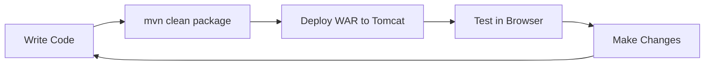

# Java Servlets Starter - Learn Web Development with Java

  

> 🎯 **Educational Repository**: Learn the fundamentals of building web applications with Java Servlets, Maven, and modern Jakarta EE technologies.

## 🎓 What You'll Learn

This repository is designed as a **hands-on learning resource** to teach you:

- **Java Servlet fundamentals** - How web applications work in Java
- **HTTP request/response lifecycle** - Understanding web communication
- **Maven project structure** - Modern Java project management
- **Jakarta EE technologies** - The evolution from Java EE
- **Web application deployment** - From code to running application

## 📚 Prerequisites

Before starting, you should have basic knowledge of:
- Java programming fundamentals
- Object-oriented programming concepts
- Basic understanding of HTTP and web browsers
- Command line/terminal usage

## 🏗️ Web Application Architecture

Understanding how Java web applications work is crucial. Here's the architecture this project demonstrates:

```
┌─────────────────┐    HTTP Request     ┌─────────────────┐
│                 │ ──────────────────► │                 │
│   Web Browser   │                     │  Apache Tomcat  │
│   (Client)      │                     │  (Web Server)   │
│                 │ ◄────────────────── │                 │
└─────────────────┘    HTTP Response    └─────────────────┘
                                                │
                                                │ Servlet Container
                                                ▼
                                        ┌─────────────────┐
                                        │                 │
                                        │  Java Servlet   │
                                        │ (Your Code)     │
                                        │                 │
                                        └─────────────────┘
```

### Request/Response Flow

1. **Browser Request**: User enters URL or clicks link
2. **HTTP Request**: Browser sends HTTP GET/POST to server  
3. **Servlet Container**: Tomcat receives request and routes to appropriate servlet
4. **Servlet Processing**: Your Java code processes the request
5. **Response Generation**: Servlet creates HTML response
6. **HTTP Response**: Server sends HTML back to browser
7. **Page Rendering**: Browser displays the result

## 🚀 Understanding the Code

### 1. The Servlet Class (`HolaMundoServlet.java`)

Let's break down the main servlet:

```java
@WebServlet("/hola")  // 🔗 Maps this servlet to the URL path "/hola"
public class HolaMundoServlet extends HttpServlet {
    
    @Override
    protected void doGet(HttpServletRequest req, HttpServletResponse resp)
            throws ServletException, IOException {
        
        // 📤 Set the response content type
        resp.setContentType("text/html");
        
        // ✍️ Get a writer to send data back to the client
        PrintWriter out = resp.getWriter();
        
        // 🏗️ Build HTML response
        out.println("<html><body>");
        out.println("<h1>Hola Mundo desde un Servlet!</h1>");
        out.println("</body></html>");
    }
}
```

**Key Concepts Explained:**

- **`@WebServlet("/hola")`**: This annotation tells the server "when someone visits `/hola`, use this servlet"
- **`HttpServletRequest req`**: Contains all information about the incoming request (parameters, headers, etc.)
- **`HttpServletResponse resp`**: Your tool to send data back to the browser
- **`doGet()` method**: Handles HTTP GET requests (when someone visits the URL)

### 2. Project Structure

```
src/
├── main/
│   ├── java/com/example/
│   │   └── HolaMundoServlet.java     # 🧩 Your servlet code
│   └── webapp/
│       ├── WEB-INF/
│       │   └── web.xml               # 🔧 Web application configuration
│       └── index.jsp                # 🏠 Default home page
└── test/
    └── java/com/example/
        └── HolaMundoServletTest.java # ✅ Unit tests

📁 Additional files:
├── pom.xml                          # 📦 Maven configuration
├── Readme.md                        # 📖 This educational guide
├── EXAMPLES.md                      # 🧪 Hands-on exercises
└── guia-mac.md                      # 🍎 macOS setup guide
```

### 3. Maven Configuration (`pom.xml`)

The `pom.xml` file manages dependencies and build configuration:

```xml
<dependency>
    <groupId>jakarta.servlet</groupId>
    <artifactId>jakarta.servlet-api</artifactId>
    <version>6.1.0</version>
    <scope>provided</scope>  <!-- Provided by Tomcat -->
</dependency>
```

**Why Jakarta instead of javax?** Jakarta EE is the evolution of Java EE, maintained by the Eclipse Foundation.

## 🧪 Try It Yourself

### Expected Input/Output Examples

**Input**: Browser visits `http://localhost:8080/HolaMundoWeb/hola`

**HTTP Request**:
```http
GET /HolaMundoWeb/hola HTTP/1.1
Host: localhost:8080
User-Agent: Mozilla/5.0...
Accept: text/html,application/xhtml+xml...
```

**HTTP Response**:
```http
HTTP/1.1 200 OK
Content-Type: text/html
Content-Length: 54

<html><body>
<h1>Hola Mundo desde un Servlet!</h1>
</body></html>
```

**Browser Output**: A web page displaying "Hola Mundo desde un Servlet!" as a heading.

### Experiment Ideas

1. **Modify the response**: Change the message in the servlet
2. **Add parameters**: Use `req.getParameter("name")` to personalize the greeting
3. **Add CSS styling**: Include CSS in your HTML response
4. **Handle POST requests**: Override `doPost()` method

> 💡 **Want hands-on practice?** Check out [EXAMPLES.md](EXAMPLES.md) for step-by-step exercises, code samples, and progressive challenges!

## 🛠️ Quick Start

### 1. Build and Test

```bash
# Compile and package the application
mvn clean package

# Run tests
mvn test
```

### 2. Deploy and Run

```bash
# Copy the WAR file to Tomcat's webapps directory
cp target/HolaMundoWeb.war $TOMCAT_HOME/webapps/

# Start Tomcat
$TOMCAT_HOME/bin/startup.sh  # On Linux/Mac
# OR
$TOMCAT_HOME/bin/startup.bat  # On Windows

# Visit your application
# http://localhost:8080/HolaMundoWeb/hola
```

### 3. Development Workflow



## 📖 Learning Path

### Beginner (You are here!)
- ✅ Understand basic servlet concepts
- ✅ Learn request/response lifecycle  
- ✅ Master Maven project structure
- 🔄 Practice with this starter project

### Intermediate (Next Steps)
- Learn about servlet filters and listeners
- Understand session management
- Work with databases (JDBC)
- Explore JSP (JavaServer Pages) in detail

### Advanced (Future Goals)
- RESTful web services with JAX-RS
- Spring Framework fundamentals
- Microservices architecture
- Enterprise patterns and practices

## 📚 Additional Resources

### Official Documentation
- [Jakarta Servlet Specification](https://jakarta.ee/specifications/servlet/)
- [Apache Tomcat Documentation](https://tomcat.apache.org/tomcat-10.1-doc/)
- [Maven Getting Started Guide](https://maven.apache.org/guides/getting-started/)

### Tutorials and Guides
- [Oracle Java EE Tutorial](https://docs.oracle.com/javaee/7/tutorial/)
- [Baeldung Java Web Development](https://www.baeldung.com/java-web-development)
- [Spring Framework Guides](https://spring.io/guides)

### Books
- "Head First Servlets and JSP" by Bryan Basham
- "Java: The Complete Reference" by Herbert Schildt
- "Effective Java" by Joshua Bloch

### Practice Platforms
- [Coding Bat Java Practice](https://codingbat.com/java)
- [LeetCode Java Problems](https://leetcode.com/)
- [GitHub Java Projects](https://github.com/topics/java)

## 🔧 Platform-Specific Setup

For detailed installation and setup instructions:

- **Windows**: See installation guide below
- **macOS**: See [guia-mac.md](guia-mac.md)
- **Linux**: Similar to macOS with package manager differences

---

## 💻 Detailed Installation Guide (Windows)

Esta guía detalla los pasos para instalar y configurar Java, Maven y Tomcat, y para desarrollar y desplegar una aplicación web con Servlets en Windows.

### **1. Instalación de Requisitos Previos**

#### **1.1 Instalar Java Development Kit (JDK)**
- Descarga la última versión del JDK desde [Oracle JDK](https://www.oracle.com/java/technologies/javase-downloads.html)
- **Nota**: Este proyecto requiere Java 11 o superior. Se recomienda Java 17 o 21 (versiones LTS)
- Instala el JDK y configúra las variables de entorno:
  1. Abre el "Panel de Control" > "Sistema y Seguridad" > "Sistema" > "Configuración avanzada del sistema".
  2. Haz clic en "Variables de entorno".
  3. Agrega una nueva variable `JAVA_HOME` con la ruta del JDK (Ejemplo: `C:\Program Files\Java\jdk-21`).
  4. Asegúrate de agregar `%JAVA_HOME%\bin` a la variable `Path`.
  5. Verifica la instalacion ejecutando:
  ```sh
     java -version
    ```

#### **1.2 Instalar Apache Maven**
- Descarga la última versión desde [Apache Maven](https://maven.apache.org/download.cgi).
- Extrae los archivos en `C:\apache-maven` y configura las variables de entorno:
  1. Crea una nueva variable `MAVEN_HOME` con el valor `C:\apache-maven`.
  2. Agrega `%MAVEN_HOME%\bin` a la variable `Path`.
  3. Verifica la instalación ejecutando:
     ```sh
     mvn -version
     ```

#### **1.3 Instalar Apache Tomcat**
- Descarga [Apache Tomcat 10.x](https://tomcat.apache.org/download-10.cgi).
- Extrae los archivos en `C:\apache-tomcat`.
- Opcional: Configura la variable de entorno `CATALINA_HOME` con `C:\apache-tomcat`.

### **2. Crear un Proyecto Maven**
Ejecuta el siguiente comando para crear un nuevo proyecto web:
```sh
mvn archetype:generate -DgroupId=com.example -DartifactId=HolaMundoWeb \
    -DarchetypeArtifactId=maven-archetype-webapp -DinteractiveMode=false
```
Esto creará la carpeta `HolaMundoWeb/` con la estructura básica de un proyecto web.

### **3. Compilar y Empaquetar la Aplicación**
Ejecuta el siguiente comando dentro del directorio del proyecto:
```sh
mvn clean package
```
Esto generará un archivo `HolaMundoWeb.war` en la carpeta `target/`.

### **4. Desplegar en Apache Tomcat**
1. Copia `target/HolaMundoWeb.war` en `C:\apache-tomcat\webapps`.
2. Inicia Tomcat ejecutando `startup.bat` en `C:\apache-tomcat\bin`.
3. Accede a la aplicación en [http://localhost:8080/HolaMundoWeb/hola](http://localhost:8080/HolaMundoWeb/hola).

### **5. Detener Apache Tomcat**
Para detener Tomcat, ejecuta:
```sh
shutdown.bat
```

Con esta guía, puedes desarrollar y desplegar aplicaciones Java Web con Servlets en Apache Tomcat. 🚀

